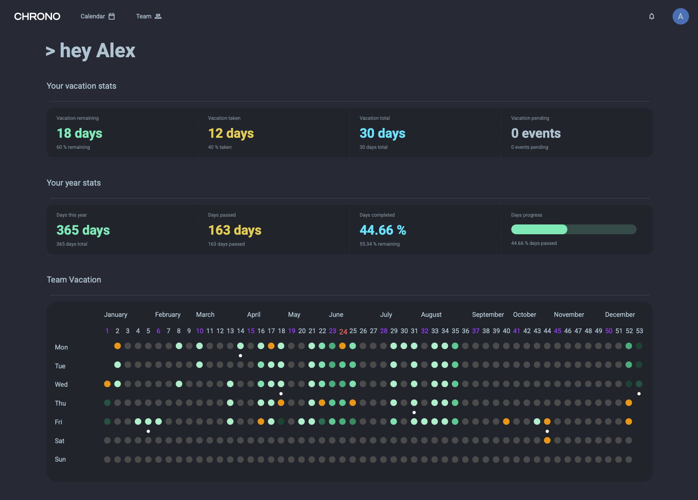
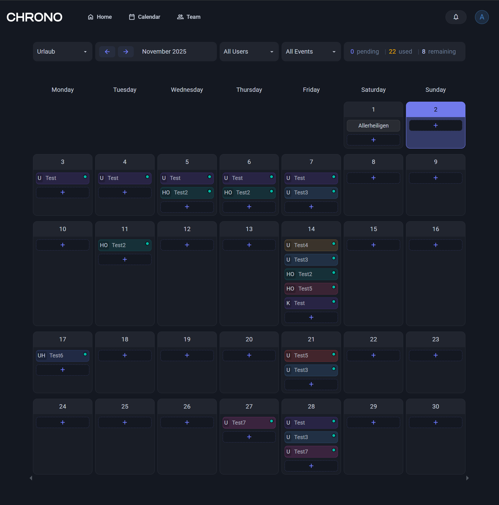

# Chrono

A vacatation and event management tool




## Requirements

- [go](https://go.dev/dl/)
- [make](https://www.gnu.org/software/make/#download) (Already preinstalled on MacOS and Linux)
- Node.js

## Installation

Make sure to have your ~/go/bin folder on PATH

Run once to install the required tools and libraries

```bash
make install
```

## Start Dev Environment

Starts backend (API on port 8080) and frontend (Vite on port 5173, or 5174 if 5173 is in use) in parallel. Open the frontend URL in your browser.

```bash
make dev
```

## Build Executable

Output folder: /build

```bash
make build
```
