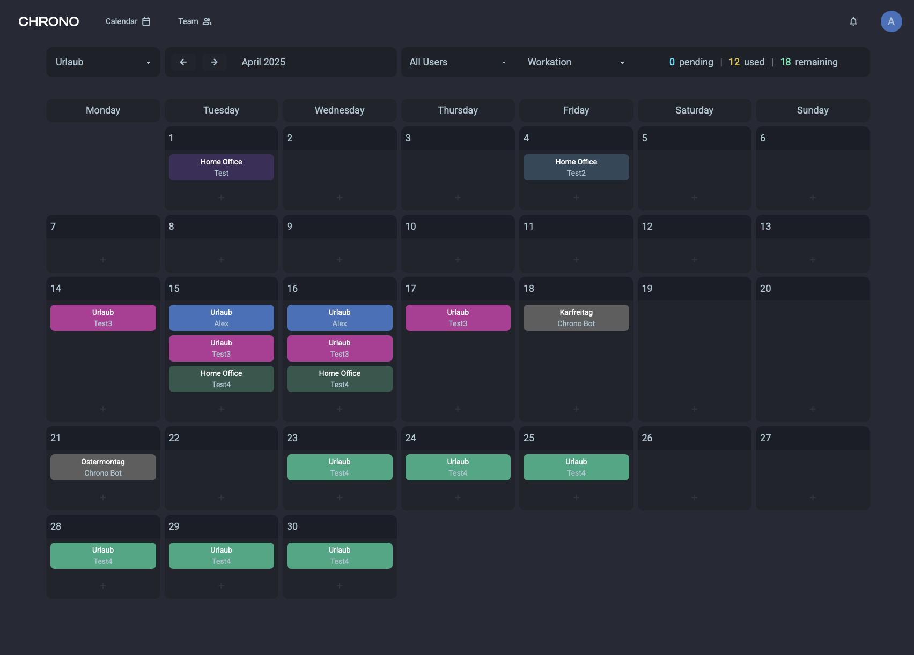

# Chrono

A vacatation and event management tool




## Requirements

- [go](https://go.dev/dl/)
- [make](https://www.gnu.org/software/make/#download) (Already preinstalled on MacOS and Linux)
- Node.js

## Installation

Make sure to have your ~/go/bin folder on PATH

Run once to install the required tools and libraries

```bash
make install
```

## Start Dev Environment

```bash
make dev
```

## Build Executable

Output folder: /build

```bash
make build
```
